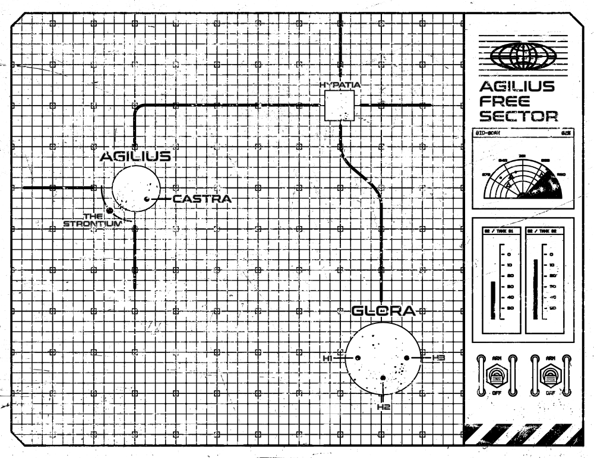
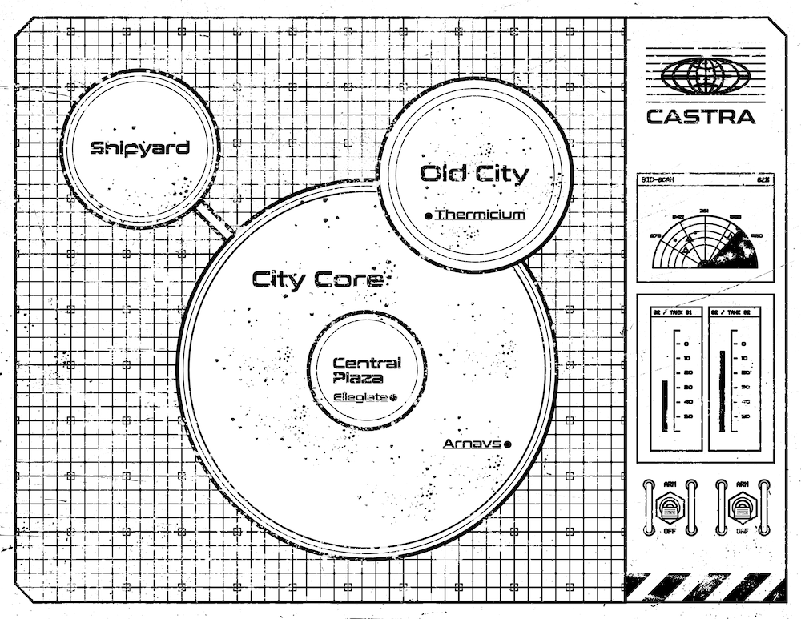

Castra was a guided [Starforged](https://tomkinpress.com/pages/ironsworn-starforged) campaign I ran loosely based on *Andor*. My group were on a post-Season 2 high and we had a spare slot, so I thought I'd give my players a little gift and run this for them.

Castra was set in the [Agilius Free Sector](#agilius-free-sector): an attempt to hammer a Star Wars-like setting into the Starforged game. Of course, I wasn't just going to run it in a vanilla Star Wars setting so I had some fun with it. Maybe subvert a few tropes. Play around with the lo-fi, steady-state futurism of 80s scifi. I dipped into Ancient Roman themes and motifs and focused on intrigue. While keeping the iron-based theme of the *Starforged*.

I'm posting it here because I don't think it's got enough meat on it to publish and it'll just be sitting on my hard drive, gathering dust.

The premise was as follows:

> It's been 30 years since the Forge Wars ended, and the victorious Fulcrum Powers dismantled the Iron Bloc.  The Old Bloc Worlds now languish under the brutal military occupancy of the Fifth Carbon Legion.
>
> You are members of the Iron Insurgency, a ragtag network of spies, sympathisers, radicals and Forge War veterans who are fighting a guerrilla war against the occupation.
>
> Despite your fervour, it's a war you've been losing, but there is hope. You've been sent on a mission to recover vital information that could turn the tide.
>
> You arrive at the backwater spaceport of Castra, a Fulcrum Special economic zone located in the Agilius Free Sector. Somewhere in the city lies a secret that could win the war against the occupation.
>
> Unfortunately, you're not the first to get there. The Strontium, a Hydra-Class Destroyer, has arrived in orbit, and its menacing presence looms over the city. For the moment you pass the centurion patrols unnoticed, but its only a matter of time before you attract unwanted attention.
>
> A local fixer has set up a rendezvous with the seller. All you have to do is show up, make the exchange and get out.

Players start as agents of the Iron Insurgency. The Insurgency is a ragtag network of spies, sympathisers, radicals and Forge War veterans who are fighting a guerrilla war against the Fifth Carbon Legion. Through a campaign of sabotage, espionage and guerrilla warfare they seek to break the occupation and re-establish the Iron Bloc. The Iron Insurgency has repurposed the heavy machinery of its industrial past as weapons against the Fifth Carbon Legion.

Players begin with Monarch (a Formidable Insurgency Contact) as their starting connection. They know very little about him, only that he's very secretive, communicates only by radio and works for the Iron Insurgency. Unbenownkst to the rest of the insurgency, Monarch is secretly raising an army to strike back at the Fifth Carbon Legion. His plan is to acquire the [Strontium](#strontium) command codes and have the party imprisoned aboard the Strontium. He has an agent aboard who can release the party so that they can then gain control of the Strontium and use it to start a war to reunite the Old Bloc Worlds.

Grand Lictor Penance ■■■■ is is hunting for Monarch. Unbeknownst to *his* superiors in Fifth Carbon Legion, he plans to help the party escape, long enough for them to lead him to his target.

I also came up with some custom moves to emphasise these storylines:

- **When Monarch aids you** take the normal benefits and roll +shadow. On a **strong hit** your discretion is rewarded. Take an additional +1 momentum. On a **miss** Fulcrum forces are alerted to your presence and you must Pay the Price.

- **While you're being followed by Penance, when you are facing defeat at the hands of the Fulcrum** roll +shadow. On a **miss** Penance intervenes to help you at the last moment. He does not give any explanation. Take +1 momentum. On a **weak hit** Penance intervenes, as on a miss, but leaves a clue as to his motivations. On a **strong hit** you must face the threat alone.

## Agilius Free Sector

The Agilius Free Sector is the core setting for *Castra*. It is a neutral zone within the Old Bloc Worlds, established as a buffer between the various Fulcrum powers.

The Agilius Free Sector belonged to Iron Bloc, a socialist union of worlds that were dismantled after a prolonged interstellar war with the Fulcrum. This sector is now part of the Old Bloc Worlds, an occupied space rich in iron ore, which was the Bloc's main export. Profits were reinvested into giant infrastructure projects, much of which now lie in ruins or have been acquired by foreign investors from Fulcrum sectors.

> [!NOTE]
>
> 
>
> Emblem of the Fifth Carbon Legion.

The Fifth Carbon Legion is occupying this sector. The Fifth Carbon Legion is the Fulcrum Legion (Legions) that invaded the Iron Bloc during the Forge Wars. It maintains a strong military presence in the Old Bloc Worlds, running counter-insurgency operations, maintaining the occupation, enforcing the draconian laws of the occupancy and brutally suppressing dissent.

The most notable location in the sector is, of course, [Castra](#castra). Other notable locations include:

- **Glora.** A solitary gas giant. Its atmosphere is rich in rare gases useful in the production of droids.
- **H2 Facility**. One of the decommissioned, rare-gas refineries that sit in the upper atmosphere of Glora.  It is now a secret Insurgency communications outpost, operated by a skeleton crew who coordinate operations in this sector. The cell is split by a leadership crisis as militant and conciliatory factions, seeking peaceful coexistence with the occupancy, vie for power.

### Castra

> [!NOTE]
>
> These maps were created using *The Department of Unusual Observations'* excellent [Sector Grid](https://deptofunusual.itch.io/sector-grids) templates. They're free, the look crazy good and really pulled together the vibe of the campaign.

Castra itself is an occupied spaceport on the storm world of Agilius. The city has been demarcated as Fulcrum special economic zone. Because of its dubious legal status, it also operates as a diplomatic no-man's-land populated by profiteers, spies and political exiles. The Fifth Carbon Legion's capital ship, [The Strontium](#strontium) (■■■■■), orbits the planet, its menacing presence looming over the city.

Principles:

- **Rust red** waters.
- Completely **polluted** with mining run-off.
- Constant **sea storms** lash the streets and buildings.
- **Political exiles** vie for off-world visas.
- **Occupied** by Fulcrum military forces and private contractors.
- Swarms with spies and **intrigue**.
- **Imperialised** shops and concessions for home-sick Centurions.

Locations and NPCs within the city include:

- **Arnav's:** seedy cantina built at the top of an inactive Iron Bloc comms antenna, damaged in the Forge Wars. It is also a front for the Iron Insurgency, where access to a secured commslinks and other support might be found.
  - **Arnav Keff.** Proprietor and Insurgency agent code-named Chimera. Paranoid, Disfigured.
- **Central Plaza.** A large, circular plaza situated at the centre of the city core. Home to a permanent bazaar, where merchants trade goods as they arrive from the space yard, day and night. It is dominated by the Ellegiate, which overlooks the plaza.
- **Ellegiate:** once Castra's premium hotel, before it was commandeered by the Fifth Carbon Legion as quarters for legionnaire officers and visiting Fulcrum dignitaries.
- **Shipyard.** The Shipyard on Castra sits apart from the city core, on a platform over the sea.
  - **FAB-R.** Nav droid who operates the shipyard on Castra. No ship operations in and out of Castra slip his notice. He  was a nav droid aboard an Iron Insurgency war ship before he was captured and re-purposed by the Fifth Carbon Legion.
- **Thermicium.** A series of thermal baths carved out of the bedrock beneath Castra. They were intended as communal baths for workers, but now they are an exclusive luxury for merchants and Fifth Carbon Legion officers.

### Hypatia

A vast, metal cube hangs in the firmament, its thick hull pockmarked with asteroid impacts, docking ports, antennae and weapon turrets.

Hypatia is a space habitat, home to thousands of Unified Sectors civilians who support the Fifth Carbon Legion operations in the Agilius Free Sector. Inside is a hive of box-like living units, offices, workshops and containers, all stacked on top of each other. It houses administrators, technicians, managers, engineers, mechanics, and all their families.

Principles:

- **Infested.** Unbeknownst to the public, Hypatia is infested by the remnants of a Fulcrum bioweapon, a mould-like fungus that is slowly poisoning the lower (and poorer) decks of the habitat. It can also awaken latent psionic powers, and Lictors are investigating why with keen interest.

### Strontium

Hydra-Class Destroyers ■■■■■ are a vast, hyperspace-capable starship and weapons platforms, typically deployed by the Legions to enforce foreign policy through intimidation and gunboat diplomacy. Each Hydra sports multiple turrets, hundreds of meters tall, each carrying an arsenal of high-energy weapons. Their combined might can bombard an entire planet.

The Strontium is a Hydra-Class Destroyer in orbit around Agilius, and acts as a base of operations for the Fifth Carbon Legion on the planet.

Principles:

- Prisoner of war black site.
- Lucina is a double-agent aboard the ship.
- Grand Lictor Penance is stationed here with three adepts.

## Enemies

### Centauri Cruiser **■■■■**

A Centauri Cruiser ■■■■ is a large transport ship, used by the Fifth Carbon Legion to deploy ground troops. It consists of a large, flat platform bristling with weapons and sensor arrays. When it lands, four large legs are deployed which sink into the mantle for stability and to give the cruiser tactical advantage from the platform's elevated position.

### Centurion ■

**Features:**

- Grey carbon-composite armour.
- Encrusted with comms and tactical gear.
- Radios pop and crackle.

**Drives:**

- Obey orders.
- Kill insurgent scum.
- Talk shit.

**Tactics:**

- Strike with overwhelming force and numbers.
- Pull back and call for reinforcements or Striga cover.
- Light it up just in case.

Centurions are the ground troops of the Legions. Now that the Forge Wars are over, they are typically stationed at permanent garrisons on occupied worlds, working "peacekeeping" operations, suppressing insurgents, and basically fighting lukewarm, forever wars with the Fulcrum's various foreign enemies. Derogatorily called "crabs" due to the crustacean-like profile of their armour and tactical gear.

### Centurion Unit ■■

Centurions will rarely be encountered alone, and  work best together. A well-trained centurion unit is greater than its parts.

### **Cerberite ■■**

**Features**

- Dog-like droids
- Thick, spider-like limbs
- Highly attuned sensors

**Drives:**

- Root out insurgents
- Constantly vigilant for threats
- Relentlessly hound targets
- Play fetch

**Tactics:**

- Leap to bring down opponents
- Clamp and hold for arrest

Cerberites are used by centurions for patrol, tracking and bomb detection. Typically accompanied by centurion handlers. Cerberite units can be wilful, and often ignore commands once they detect enemies.

### Penance  ■■■■

**Features:**

- Querulous voice and erratic manner
- Graven, bearded mask
- Shrivelled and scarred mouth
- Long, piercing neurotoxin tongue
- Master of combat psionics

**Drives:**

- Destroy the Iron Insurgency
- Seek out and kill Monarch
- Indulge in sadistic torture

**Tactics:**

- Lurk in shadows and jump out at strategic moment
- Strike quickly and deadly with bioweapon tongue
- Turns target's bodies against themselves

Grand Lictor Penance is a Fulcrum llictor, psionic and spy-catcher.

### Striga ■

Striga are deployed by the Legions for precision ship-to-ship and land-to-air conflict. The distinctive sound profile of their sub-light thrusters can strike fear in the hearts of Fulcrum enemies.

### Striga Flock ■■■

Carriers can deploy hundreds of Striga at a moments notice, swarming enemy craft with overwhelming force.

### Striga Swarm ■■■■

A larger carrier, like a Hydra-Class Destroyer, can deploy thousands of these fighters.

## Appendix: Vibes

We shouldn't really call them [spark tables](https://www.bastionland.com/2017/11/electric-modernity-and-spark-tables.html), vibe tables are a way better term. Whatever, here is a random table to spark your imagination when you're stuck and want something thematic.

<vellum-random-table select="#result" preroll hidecalc class="two-column">

| d20  | Spark 1         | Spark 2      |
| ---- | --------------- | ------------ |
| 1    | Counter         | Insurgency   |
| 2    | Imperial        | Espionage    |
| 3    | Colonial        | Resistance   |
| 4    | Guerrilla       | Warfare      |
| 5    | Steady-state    | Camp         |
| 6    | Orbital         | Fatigue      |
| 7    | Training        | Relay        |
| 8    | Insidious       | Collaborator |
| 9    | Splinter        | Defector     |
| 10   | Prison          | Camp         |
| 11   | Slick           | Massacre     |
| 12   | Power           | Traitor      |
| 13   | Iron            | War          |
| 14   | Carbon          | Tail         |
| 15   | Separatist      | Tell         |
| 16   | Slate           | Station      |
| 17   | Cobalt          | Smelter      |
| 18   | Mustard         | Schism       |
| 19   | Turquoise       | Trace        |
| 20   | Scuffed         | Trouble      |

<my-button class="small">
<button>Roll</button>
</my-button>
<input id="result" type="text" />

</vellum-random-table>

## Appendix II: Clues and Rumours

<vellum-random-table select="#result" preroll hidecalc class="two-column">

| d20 | Clue or Rumour                                                                                                                       |
|-----|--------------------------------------------------------------------------------------------------------------------------------------|
| 1   | Endo Rees recently disappeared from Castra without a trace.                                                                          |
| 2   | Comms logs showing unusually large amounts of comms to and from the H2 Facility on Glora.                                            |
| 3   | Palp Nominus received payment from Monarch in person.                                                                                |
| 4   | There is an Insurgency (Iron Insurgency\) commslink hidden in a backroom at Arnavs.                                                  |
| 5   | Navlogs showing Monarch's unregistered ship heading from Agilius back to Archive/🪐 Castra/Hypatia.                                  |
| 6   | Centurions (Centurion ■\) are searching Castra for a missing Knot bioweapon (false).                                                 |
| 7   | An old holo from the Forge Wars showing Monarch and his unit.                                                                        |
| 8   | The Senator has recently made a generous donation to the Force Charity.                                                              |
| 9   | The Senator recently visited Archive/🪐 Castra/Hypatia on a fact finding mission where she met with Monarch.                         |
| 10  | ARG-O recently returned to Castra from the H2 Facility to pick up spare transmitter parts.                                           |
| 11  | Commslogs between Strontium agent and Monarch.                                                                                       |
| 12  | Commslogs between Monarch and Orm training compound.                                                                                 |
| 13  | Penance (Grand Lictor Penance ■■■■\) and Monarch are old enemies.                                                                    |
| 14  | Legions tracker has been planted on the PCs ship since its last engine re-platting, several months ago.                              |
| 15  | There is an Insurgency (Iron Insurgency\) commslink hidden in Monarch's office on Archive/🪐 Castra/Hypatia.                         |
| 16  | Iron Insurgency to blame for the recent Massacre at a Force Charity camp in Warzone (false).                                         |
| 17  | Strontium agent sends a message to the party reading PNCE WNTS U T LD HIM T CDIUM                                                    |
| 18  | A comms from The Captain to Grand Lictor Penance ■■■■ asking him for an update and demanding he report to the Strontium immediately. |
| 19  | The party are being followed by a hooded figure.                                                                                     |
| 20  | The Ernelius docked at Castra recently, despite the fact there hasn't been an iron mine here for years.                              |

<my-button class="small">
<button>Roll</button>
</my-button>
<input id="result" type="text" />

</vellum-random-table>
