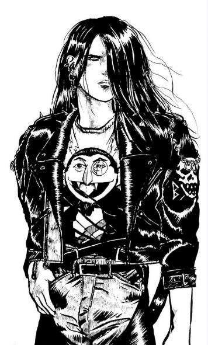

> Curseborne is a game about being unapologetic monsters in a world where being monstrous is the least of your worries.
>
> - *[Curseborne](https://www.curseborne.com/)* from Onyx Path Publishing, 2025

*Curseborne* (*Onyx Path's* new urban fantasy TTRPG) has brought me to a crisis. I'm asking myself questions I don't really want the answers to. Like, have I become everything I hate? Am I an awful grognard? Am I *uncool*?

No, that can't be right. It must be those kids at *Onyx Path Publishing* who are wrong. Although, now I think about it, surely many of the people working the levers at Onyx are in my age cohort? What is Onyx but an act of nostalgia itself? Its original purpose to resurrect game lines that died with the original *White Wolf*. And who would've been playing and then later republishing those original games? Why, the very same sort of Gen Xers I was playing with in the 90s.

> [!NOTE]
>
> In this post use the terms urban fantasy and urban horror interchangeably. *Curseborne* describes itself as urban fantasy, but I don't think that really does justice to the genre. For reference, *Vampire: the Masquerade* is described as urban horror or fantasy equally often online.

Why has *Curseborne* brought me to this crisis? Well, let me first explain what *Curseborne* is. Onyx have lost the license to punish *World of Darkness* material now that *Paradox* - the actual rights holders - are publishing new material. This leaves Onyx without an IP for their specialist genre: urban fantasy. In other words, *Curseborne* is an attempt to replace *Paradox's* IP with an original setting of their own.

Which is why *Curseborne* fills me with apprehension: it is game haunted, if you will, by *Vampire: the Masquerade*, *Mage: the Ascension* and others. It is, essentially, a product of pure nostalgia. A game written with the dubious premise "like the World of Darkness but different." Not that it's an unreasonable objective, but it comes from a place of practicality rather than creativity. *Curseborne* doesn't start with a need and follow through with a game. It starts with a game in the hope it will become a need. It's not cynical, but maybe it's not entirely authentic either.

Of course, authenticity itself is subjective, and, as you'll see, *Curseborne* is something of a love letter to the urban fantasy genre, which is why I hold out hope. Can Onyx thread the needle here? Can lightning strike twice? Can *Curseborne* give the *World of Darkness* a run for its money? Or, better yet, could it be something entirely different; compelling for WoD fans, but bringing its own, unique vision to the table?

Maybe, but I also have some reservations with *Onyx Path Publishing* themselves. Their audience seems to consist mostly of hardcore WoD fans who are willing to fork out cash on Kickstarters and expensive print-on-demand editions. (No shade here, I'm one of them.) This can lead to derivative and lengthy works filled with tedious lore that lacks much of the inventiveness of the original games, published to feed an insatiable hunger for nostalgic content regardless of quality. Many of these works are impenetrable, obscure and, well, a bit crusty.

And that's bad because 90s *White Wolf's* real product wasn't really games, it was cool. The designers and illustrators seemed to be people hipper than you and, whether or not that was actually true, that's what brought new players into the games. Urban fantasy must be, if it is anything, stylish and desirable and *new*, and if it isn't, well, what are you doing?

> [!NOTE]
> 
>
> It's not controversial to say that the iconic art of Josh Timbrook was at the heart of what made the *World of Darkness* so appealing. His fashion-conscious illustrations oozed sex appeal, and set the bar (or should have) for all art in urban horror games. I'm not sure the *Curseborne* art lives up to his example.

So, can *Curseborne* be stylish and desirable and *new*?

It's a question that fills me with existential dread because the lingering subtext here, the awful suspicion, is: can *anyone* my age create something stylish and desirable and new? Because this isn't just a review of *Curseborne*, it's an examination of my youthful relationship with the original *World of Darkness*. The comparison to the OWoD might seem unfair to Onyx but I still believe better things are possible. I believe that if we look at what made the OWoD work, we can create new urban settings just as good, if not better.

The question is, did Onyx learn the right lessons?

## The review itself

Where to begin? *Curseborne* is about 400 pages which is relatively short for an *Onyx Path* core book but it's dense, including five splats, about thirty sub-splats and at least 3 magic systems. Instead of going from page to page I'll address each of the core elements of an urban fantasy setting.

But what are the core elements? Here is my reckon:

1. Monsters
2. Dark World
3. Secret Society
4. Splats
5. Secret Wars

I'll be looking at the fictional and meta aspects of each of these elements. The fiction adds a degree of consistency and realism that ground the setting, while the meta aspects support the fantasy of playing a monster.

### 1. The monsters are real

The core conceit of urban fantasy is, of course, that monsters are real, and in *Curseborne* these monsters are the capital-A Accursed. The world is filled with curses, but the Accursed are more cursed than most. So cursed they have internalised this power to become your standard spread of urban fantasy monsters: lycanthropes, vampires and others. And, of course, with their curses come supernatural powers and access to magic, because it's not urban fantasy without cool powers.

### 2. A darker world

If supernatural monsters are real, this implies a world bleaker than our own. We might not notice them, but we would notice the consequences of their existence: corruption, missing persons, crime, etc. Conversely, if monsters can hide it means their atrocities are at least comparable to those of human's.

The Darker World must be like the real world because familiarity is big part of the fantasy here. It has to be a world where the players could reasonably imagine themselves to exist, only deviating from reality as much as allows for the existence of monsters without breaking this assumption. In a way it is the opposite of traditional fantasy settings, whose appeal is that they offer a clear break from our reality.

However, the Darker World also supports the core fantasy of urban horror. If you want to play angst-ridden characters, you simply must have something to be angsty *about*. *Curseborne* deviates here. It describes itself as hopepunk, as opposed to the gothic-punk of the WoD. Despite some research, I'm still not sure what that means, or what is particularly hopeful about the setting of *Curseborne*, but there you go.

Well, *Curseborne* is set in something I'm calling the "Cursed World," but which doesn't actually have a name in the book. It's their equivalent of the World of Darkness: the world is literally cursed, crawling with curses. Everyone experiences a constant stream of them, creating a permanent, dismal atmosphere, but the Accursed are more cursed.

### 3. A secret society

[Wainscot Society - TV Tropes](https://tvtropes.org/pmwiki/pmwiki.php/Main/WainscotSociety)

Monsters are not only real, some of them are people.

My favourite part of any WoD setting is: why doesn't everyone know about the monsters? The fantasy WoD delivers is not just that you are a creature of darkness, but that you are also part of a hidden, parallel society with its own intrigues and conflicts. Over the years *White Wolf* employed a number of devices to explain how monster stay hidden: Paradox, the Veil, the Delirium etc. In *Curseborne* however there's no Masquerade, no Technocracy, no grand conspiracy. People just rationalise the supernatural away. The general populace just don't care, which is at least an original sharp turn from the angst of the WoD.

Most of the rest of the chapter is then dedicated to the cosmology of the setting, which revolves around "liminalities." Liminalities are folds in reality, small dimensions that are hidden away from the rest of world. Here, the Accursed can play out their dramas without fear of discovery. They are havens, adventure locations, plot devices, even NPCs or treasures. And they are, of course, liminal, not just places between magic and the mundane, but also liminal in the contemporary, horror sense. I'm not going to get into a discussion on the subject of liminal horror in this post, it's too big a subject. However, it is fashionable.

So far so good. The setting elements - liminalities, Accursed, etc. - are inventive, sympathetic to the themes and give a creative arena of play. It's a little tepid, but the bones are solid

I think the thing I like least are loopholes: liminal break rooms, where Accursed powers don't work which act as safe spaces for them to socialise. It's a bit Hogwarts common room, a bit club treehouse, a bit twee. It's an element of the setting that serves a distinctly meta need without any good in-setting rationale.

Like the *Chronicles of Darkness*, *Curseborne* is less global, with less canon. It's more distributed and local. There is no overarching conflict. Unfortunately, this also leaves the setting a little... uninspiring? I'm don't immediately understand what player characters are supposed to do. I don't immediately identify with the Accursed. What stories are you I supposed to tell? Liminalities sound cool at first, but the execution is confusing and complicated. Most liminalities are places, but they can also be people and things. They serve a variety of functions, some very specific, which hint at

### 4. Splats of course

- [ ] Silhouettes

Here is the heart of the matter. Urban fantasy TTRPGs live or die by their [splats](https://whitewolf.fandom.com/wiki/Splat#Fatsplats,_secondary_splats,_and_tiers). They introduce the aesthetic, core concepts, themes and motifs.

*Curseborne* splats seem to be adapted from the *Chronicles of Darkness*/*New World of Darkness* convention. There are a fixed set of inherent splats (like the clans from *Vampire: the Requiem*) and an expansive list of secondary splats, that refine the main concepts into more specific character types (like *Vampire: the Requiem* bloodlines). We have the "lineages" which represent the core, urban fantasy archetypes: your vampires, werewolves, etc. And each lineage then has 5-6 secondary splats, called "families".

These families work as both social and inherent factions, and there are around 30 of them, which seems like a lot. And here we come to my first, big objection to *Curseborne*. The original WoD books kept splats to a minimum, usually no more than 13 in a core book. This is because splats are supposed to simplify the character creation process. You pick the splat first, and worry about the details later.

There is a reason *White Wolf* had almost completely separate settings for each of their splats, each only tangentially linked to the others and often with contradictory lore, cosmology and play styles. I think this might be the secret sauce of the original *World of Darkness*: instead of trying to streamline all the monster legends into one mythos and blandifying them, *White Wolf* instead realized that each of the legends has their own core themes and motifs that would be best served by each splat having its own aesthetic and mythos, and not worrying about the contradictions.

*Curseborne* seems to be doing the opposite of this. Each lineage is really a flat splat, with its own set of rules specific to its archetype. Once you've figured out what you want to play, only then can you start to choose a family. It's a daunting choice, and probably a meaningless one for new players. The families have subtle themes that require a bit of reading between the lines. It's not obvious, for example, that the Munificients are supposed to be djinn analogues, and families are a mix of archetypal (like the Chimerae) and original, setting-specific groups (like the ZEDs).

Now, geeks love lists of lore. Yet lore should be doled out sparingly.

*Curseborne* falls into the trap of trying to do everything at once, and doing nothing well and creating a series of bland splats that work well together, but are otherwise insipid and unoriginal.

To add to the complexity, this chapter heavily references complex mechanics from later chapters.

What's more, the Accursed are supposed to be tormented, damned, yet many of the lineages and families don't seem particularly tortured.

**Chapter 3: The Accursed.**

**Chapter 4: Storypath Ultra System.** The joy of the original Storyteller system was its flexibility. With the simple mechanic of combining Attribute + Ability vs Difficulty, it allowed you to come up with small systems on the fly. Or rulings, as we like to call them now. Sure, there were systems (or maybe procedures?) for combat and social conflict, but they could be hand-waved with a single roll.

The Storypath Ultra System (doesn't that sound just like a paramilitary group?) is far more elaborate. Not only do you have Skills, Attributes and Difficulties, there are also Tricks, Complications, Momentum, Status Effects, Areas and curse die. That's a lot. Perhaps it gives narrative richness, but it's showing *Onyx Path*'s propensity for complexity.

**Chapter 4: Making an Accursed.** I suppose it makes sense this chapter comes after the rules chapter but, as we saw from the lineages' chapter, . Again, conventional wisdom is that you should lead with the character creation rules because, well, that's the order in which you play the game: you create characters first and then learn the specific rules later. Reversing this only adds to the inaccessibility of the game.

**Chapter 5: Accursed Magic.** I miss the simplicity of disciplines from *Vampire: the Masquerade* or gifts from *Werewolf: the Apocalypse*. You either could or couldn't do an effect.

Again, complexity rears its ugly head. All Accursed can cast spells. Each spell has a number of "extras" you can buy so they become more powerful and flexible. Spells are grouped by Practices. Lineages can only access certain practices. However, some spells can be used by other lineages.

What's more, Accursed can also have other powers called Edges.

**Chapter 6: Storyguiding.**

### 5. Always the secret war

> [!NOTE]
>
> Looking for more information on adversaries, I picked up the *Curseborne Tasty Bit Omnibus* (terrible name) for some insight. It's a collected volume of enemies that was published in the lead up to the release of *Curseborne*. Antagonists here seemed to include very few venators, and focused on more supernatural threats like corrupted Accursed, phantasms and Fae servants.

Well, maybe not always.

The *World of Darkness* has some of the greatest villains in tabletop roleplaying. The Wyrm, the Technocracy, Oblivion and Banality. All horrifying in their own way, and they're not just iconic. They define the setting and themes as much as the splats do. What are the Garou with their war against the embodiment of ecological corruption?

Yet, in the 30 years since the OWoD, trends have moved away from monolithic settings. The chief complaint against the WoD was always the dreaded metaplot, a vast body of lore shaped by the monolithic entities in the setting: the Carmarilla, the Hierarchy, etc. It made it almost impossible for casual players to dip into the various game lines, and so White Wolf moved away from metaplot in subsequent game lines, such as *Vampire: the Requiem*.

**Chapter 6: Adversaries.** Second only to the splats chapter, the adversaries define urban fantasy games.

## Summary

It's dense, but only because it tries to cover so much ground, and the content we have is a little shallow. There's lots going on, but it feels like there is no unifying whole. The initial editions of the *World of Darkness* games were a little sparse, but they were punchy, thematic and got the point. *Curseborne* is lacking here.

But there is no core conflict here! Merely a lot of smaller ones, that don't seem to represent any significant threat to the splats.

To be honest, *Curseborne* isn't bad. It has some nice elements and perhaps I should reserve judgement until it's had time to bed in. A few good supplements can turn a game line around, or elaborate on the original designers intentions to reveal a better game beneath.

What it isn't is a beginner's game. I'm not sure new player's could properly consume it without the complicated historical context of the *World of Darkness* game lines that came before. Is *Curseborne* more complicated than *Dungeons & Dragons 5th Edition*? No. Could it easily be a lot simpler? Absolutely.
